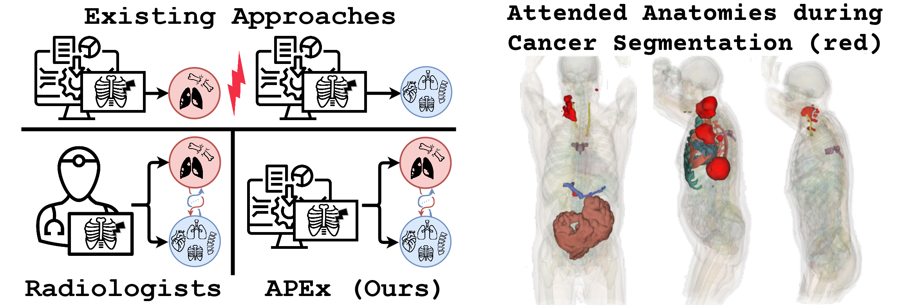

<h1 align="center">Anatomy-guided Pathology Segmentation</h1>
<h3 align="center">An Investigation on how to incooperate Anatomical Knowledge for Pathology Segmentation (MICCAI'24)</h3>

<p align="center">
    <a href="https://arxiv.org/pdf/2407.05844">
    </a>
    <a href="https://github.com/alexanderjaus/APEx/blob/main/LICENSE">
    </a>
    <a href="https://drive.google.com/drive/folders/14U9LHb18JVVlIgxSoenlMQTOOpnzuB0E?usp=sharing"></a>
    <a href="https://hits.seeyoufarm.com"></a>
</p>

<p align="center">
    
</p>

## Installation
### Requirements

- Linux or macOS with Python ≥ 3.6
- PyTorch ≥ 1.9 and [torchvision](https://github.com/pytorch/vision/) that matches the PyTorch installation.
  Install them together at [pytorch.org](https://pytorch.org) to make sure of this. Note, please check
  PyTorch version matches that is required by Detectron2.
- Detectron2: follow [Detectron2 installation instructions](https://detectron2.readthedocs.io/tutorials/install.html).
- `pip install -r requirements.txt`

### CUDA kernel for MSDeformAttn
After preparing the required environment, run the following command to compile CUDA kernel for MSDeformAttn:

`CUDA_HOME` must be defined and points to the directory of the installed CUDA toolkit.

```bash
cd model/modeling/pixel_decoder/ops
sh make.sh
```

## Dataset Preparation for PET/CT 
To run the model within the PETCT domain, we rely on two datasets: [AutoPET](https://www.cancerimagingarchive.net/) providing lesion annotations and [Atlas](https://github.com/alexanderjaus/AtlasDataset) providing anatomical annotations. Please download the respective datasets.

After preparing the original datasets, the Atlas dataset should looks like this. Note that you do not need the image folder for the Atlas_dataset_V1. The folder with the labels are sufficient.
```
Atlas_dataset_V1
    ├── images
    │   ├── AutoPET_0af7ffe12a_96698_0000.nii.gz
    │   ├── AutoPET_0b57b247b6_42966_0000.nii.gz
    │   ├── AutoPET_0b98dbe00d_83616_0000.nii.gz
    │   └── AutoPET_0c13e4df10_89759_0000.nii.gz
    |   └── AutoPET_0c13e4df10_89759_0000.nii.gz
    └── label
        ├── AutoPET_0af7ffe12a_96698.nii.gz
        ├── AutoPET_0b57b247b6_42966.nii.gz
        ├── AutoPET_0b98dbe00d_83616.nii.gz
        └── AutoPET_0c13e4df10_89759.nii.gz
```
And the AutoPET dataset should look like this
```
AutoPET_2
    ├── Clinical Metadata FDG PET_CT Lesions.csv
    └── FDG-PET-CT-Lesions
        ├── PETCT_0011f3deaf
        │   └── 03-23-2003-NA-PET-CT Ganzkoerper  primaer mit KM-10445
        │       ├── CT.nii.gz
        │       ├── CTres.nii.gz
        │       ├── PET.nii.gz
        │       ├── SEG.nii.gz
        │       └── SUV.nii.gz
        ├── PETCT_01140d52d8
        ...
```
To generate the Apex training dataset, we provide a skript that assumes the two aforementioned datasets are available. The ```generate_apex_petct_training_dataset.py``` script is used to create a training dataset for PET/CT images by processing and pooling data from various sources. This script handles the creation of volumetric datasets, resampling of anatomy labels, slicing of volumetric images into 2D slices, and pooling of data into a structured format.

Usage
```sh
python generate_apex_petct_training_dataset.py <autopet_path> <atlas_labels> <pet_atlas_complete> <slices_dataset_target> <metadata_csv_path> [--cleanup]
```
Arguments

- ```autopet_path```: Path to the AutoPET root directory.
- ```atlas_labels```: Path to the atlas labels directory (e.g Atlas_dataset_V1/label).
- ```pet_atlas_complete```: Path to the directory where the volumetric Apex dataset will be created.
- ```slices_dataset_target```: Path to the directory where the 2D slices dataset will be created.
- ```metadata_csv_path```: Path to the metadata CSV file, present in the AutoPET directory.
- ```--cleanup```: Optional flag to remove the original sliced image files after pooling. Default is True.

The script does not delete the volumetric pet_atlas_complete dataset after creation, it however is safe to delete, as Apex works on sliced volumetric images.

## Train your own Model

To train your own model using the provided scripts, follow these steps:
1. **Prepare the Dataset**:
    - Ensure that you have generated the training dataset using the `generate_apex_petct_training_dataset.py` script as described above.

2. **Configure Training Parameters**:
    - Edit the configuration file (e.g., `config.yaml`) to set the desired training parameters such as learning rate, batch size, number of epochs, etc. We provide 
    - Set the environment variable ```"DETECTRON_DATASET":"<slices_dataset_target>" ```

3. **Run the Training Script**:
    - Use the following command to start the training process:

    ```sh
    python train_model.py --config path/to/config.yaml --data_dir path/to/slices_dataset_target --output_dir path/to/output
    ```

#### Arguments
- `--eval-only`: Optional flag to only evaluate a model checkpoint
- `--config`: Path to config file for the training. We provide a default config in `training_skripts/petct_configs/petct_config_anatomical_true_cross_attention.yaml`
- `--num-gpus`: Number of GPUs to run distributed training on. 

The project uses Hydra for configuration, allowing you to append configs directly to the main command when running a script. Typically the output directory and the current data split on which the model should be trained should be defined. This is shown via an example below.

#### Example

```sh
python train_model.py --config training_skripts/petct_configs/petct_config_anatomical_true_cross_attention.yaml OUTPUT_DIR output/debug SOLVER.IMS_PER_BATCH 8 split 1
```

### Project status
- [x] Provide Code for PET/CT
- [x] Provide Pretrained PET/CT Models
- [ ] Provide Code for X-Ray domain
- [ ] Provide Pretrained X-Ray Models


### Acknowledgements
We thank the authors of Mask2Former as we heavily build upon their [repository](https://github.com/facebookresearch/Mask2Former)


Please consider citing our work when you the code of this repository. 
```
@inproceedings{jaus2024anatomy,
  title={Anatomy-guided Pathology Segmentation},
  author={Jaus, Alexander and Seibold, Constantin and Rei{\ss}, Simon and Heine, Lukas and Schily, Anton and Kim, Moon and Bahnsen, Fin Hendrik and Herrmann, Ken and Stiefelhagen, Rainer and Kleesiek, Jens},
  booktitle={International Conference on Medical Image Computing and Computer-Assisted Intervention},
  pages={3--13},
  year={2024},
  organization={Springer}
}
```
